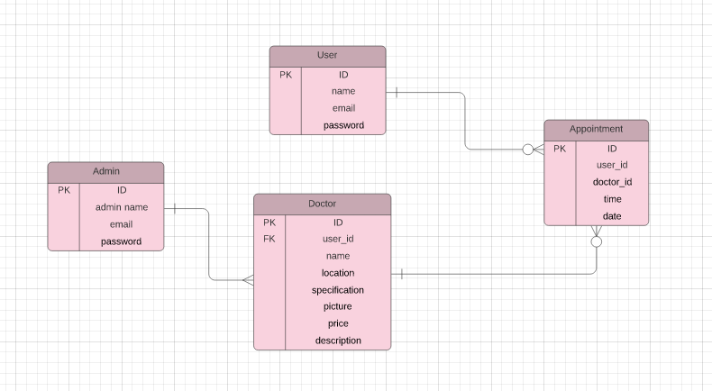

# Project Name
## Recovon App
- The backend of an app aimed at helping patients where ever they are in the world
- They can book an apointment with a doctor.
- There are different doctors to chose from so your health is always assured by one of them
- API created with ruby on rails.
- You can create your apointment and see them in the my appointment page
- Follow the link below to get to the front end of this app.

# ERD Diagram
> 

## test screenshot

## link to front end
 Front-end: [Recovon](https://github.com/ahmetbozaci/recovon-frontend)

# kanband Board
- [] Total Number of Members 03
- [Ahmet](https://github.com/ahmetbozaci)

## Heroku
deployed from develop branch
https://final-api-55.herokuapp.com/

## Built With
* Ruby on Rails
* Jwt
* Psql

## Getting Started

### Prerequisites

* Ruby (ruby --v 2.7.5)
* Postgrestsql (psql --version)
* Node.js (node --v)
* Yarn (yarn --v)

To get a local copy up and running follow these simple example steps.

Run in your terminal `git clone https://github.com/tufoinnkuo10/Transaction_App`

### Install RSpec

To run the tests locally :

* To instal RSpec for testing please run the following command on your terminal:

 ` gem install rspec`

 ` run rails rspec spec/models`

### Helpful links to solve some issues

* [Could not find gem](https://stackoverflow.com/questions/32491201/could-not-find-gem-pg-0-12-4-ruby-in-any-of-the-gem-sources-listed-in-your)
* [Install psql](https://harshityadav95.medium.com/postgresql-in-windows-subsystem-for-linux-wsl-6dc751ac1ff3)
* [PG:: InsufficientPrivilege: ERROR:  must be owner of database blog_app_development](https://stackoverflow.com/questions/25610753/activerecordstatementinvalid-pgerror-error-must-be-owner-of-database)

## Run the application
-connect to your psql
-  run `rails s` in your terminal

## Authors

👤 **Ali Abbani**
- [GitHub](https://github.com/aliabbani)
- [AngelList](https://angel.co/u/ali-abbani)
- [LinkedIn](https://www.linkedin.com/in/ali-abbani-8b6246150/)

👤 **Ahmet Bozacı**
- [Github](https://github.com/ahmetbozaci)
- [Twitter](https://twitter.com/ahmtbozaci)
- [LinkedIn](https://www.linkedin.com/in/ahmetbozaci/)

👤 **Tufoin Nkuo**
- [GitHub](https://github.com/tufoinnkuo10)
- [Twitter](https://twitter.com/itztenten)
- [LinkedIn](https://www.linkedin.com/in/tufoin-nkuo-3b272320b)

## 🤝 Contributing

Contributions, issues, and feature requests are welcome!

Feel free to check the [issues page](../../issues).

## Show your support

Give a ⭐️ if you like this project!

## Acknowledgments

- A special thanks to Microverse for inspiring this project. We are indebted to you all at Microverse
- A special thanks goes to all our peers at Microverse for being there for us.

## 📝 License

This project is [MIT](./MIT.md) licensed.

